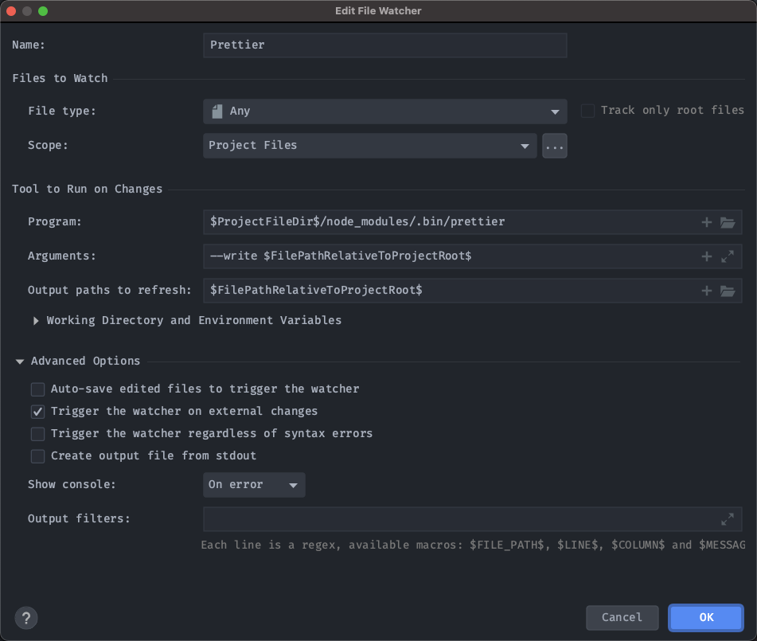

# 项目笔记

## 安装

```shell
# 克隆项目
git clone https://github.com/PanJiaChen/vue-element-admin.git

# 进入项目目录
cd vue-element-admin

# 安装依赖
npm install

# 建议不要用 cnpm 安装 会有各种诡异的bug 可以通过如下操作解决 npm 下载速度慢的问题
npm install --registry=https://registry.npm.taobao.org

# 本地开发 启动项目
npm run dev
```

## 安装 prettier 相关包

```shell
npm i @vue/eslint-config-prettier eslint-plugin-prettier prettier -D
```

更改 `.eslintrc.js`:

```js
module.exports = {
  // ...,
  extends: ["plugin:vue/recommended", "eslint:recommended", "@vue/prettier"],
  rules: {
    "prettier/prettier": [
      // 上方 extends 中 "@vue/prettier" 的自定义配置
      "warn",
      {
        "#": "prettier config in here :)",
        printWidth: 180, // 一行的字符数，如果超过会进行换行，默认为80
        tabWidth: 2, // 一个tab代表几个空格数，默认为2
        useTabs: false, // 是否使用tab进行缩进，默认为false，表示用空格进行缩减
        semi: false, // 行尾是否使用分号，默认为true
        singleQuote: false, // 字符串是否使用单引号，默认为false，使用双引号
        quoteProps: "as-needed", // 对象属性的引号使用 as-needed:仅在需要的时候使用 | consistent:有一个属性需要引号，就都需要引号 | preserve:保留用户输入的情况 默认 as-needed
        jsxSingleQuote: false, // 在JSX中使用单引号而不是双引号。默认 false
        trailingComma: "all", // 是否使用尾逗号，有三个可选值 'none':末尾没有逗号 | 'es5':es5有效的地方保留 | 'all':在可能的地方都加上逗号 默认为es5
        bracketSpacing: true, // 字面量对象括号中的空格，默认true
        jsxBracketSameLine: false, // 将多行JSX元素的>放在最后一行的末尾，而不是单独放在下一行(这不适用于自闭元素)。默认false
        arrowParens: "avoid", // 箭头函数中的括号 'avoid': 在有需要的时候使用. Example: x => x | 'always' - 一直使用. Example: (x) => x
        rangeStart: 0, // default:0
        rangeEnd: null, // default:Infinity
        insertPragma: false, // default:false
        requirePragma: false, // default:false
        proseWrap: "preserve", // 不包装 markdown text default:"preserve"
        htmlWhitespaceSensitivity: "strict", // HTML空白敏感性 default:"css"
        vueIndentScriptAndStyle: false, // 缩进vue文件中的script和style标签 false:不缩进Vue文件中的脚本和样式标签 | true - 缩进Vue文件中的脚本和样式标签 默认false
        endOfLine: "auto", // 设置统一的行结尾样式 "lf": 仅换行（\ n），在Linux和macOS以及git repos内部通用 | "crlf": 回车符+换行符（\ r \ n），在Windows上很常见 | "cr" - 仅回车符（\ r），很少使用 | "auto" - 保持现有的行尾（通过查看第一行后的内容对一个文件中的混合值进行归一化）地址：https://stackoverflow.com/questions/53516594/why-do-i-keep-getting-delete-cr-prettier-prettier
        embeddedLanguageFormatting: "auto", // default:"auto"
      },
    ],
  },
};
```

项目根目录新建 `.prettierrc.js` 文件，代码见文件内部。

## VSCode 相关配置

在项目根目录新建 `.vscode` 文件夹，包含内容见 `./.vscode/` 。

此配置可以让使用 VSCode 的人安装相关插件提高开发效率。

## webstorm 相关配置

webstorm 关于如何配置 prettier 的链接：

https://www.jetbrains.com/help/webstorm/prettier.html

1. 安装 prettier 依赖
2. 安装 prettier 的 webstorm 插件

另外需要注意的一点是：

如果你不想使用 prettier 的默认配置，而是想使用第三方配置或自定义的配置，其配置文件名建议是：prettier.config.js，而 .prettierrc.js 这样的文件则是不可信的，具体 issue 见如下地址：

https://youtrack.jetbrains.com/issue/WEB-35472

好了，如果我现在已经有了这么一个文件名称为：prettier.config.js 的配置文件，该如何让 webstorm 应用该配置？

1. 打开文件 → 设置 → 工具 →File Watcher
2. 点击 +，选择 prettier
3. 没有 prettier 的，需要自行配置 prettier ：文档见 https://prettier.io/docs/en/webstorm.html#running-prettier-on-save-using-file-watcher 配置截图：
   
4. 一般来说，完全不需要改动配置，直接确定即可
5. 打开文件 → 设置 → 快捷键，查看“prettier”的快捷键是什么：
6. 打开要格式化的文件，cmd+alt+s 就 ok 了
7. end

## build/index.js 作用

注释见该文件夹

## 提取 mock 数据 baseURL

见 `mock` 文件夹。
